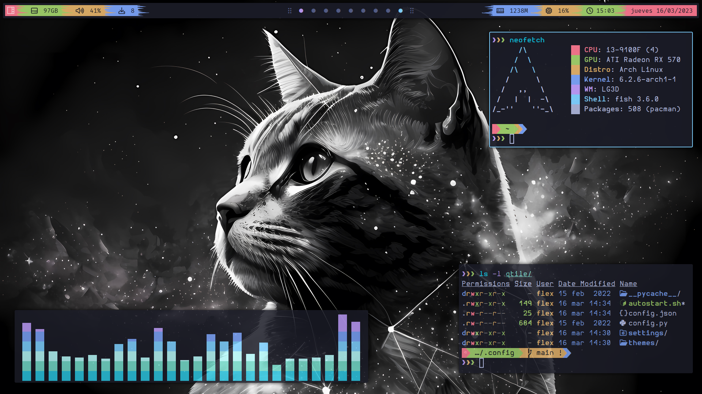

# My ArchLinux

# Info
- **OS** - [Arch Linux](https://archlinux.org/)
- **Window Manager** - [Qtile](https://github.com/qtile/qtile)
- **Terminal** - [Alacritty](https://github.com/alacritty/alacritty)
- **Shell** - [Fish](https://fishshell.com/)
- **Prompt** - [Starship](https://starship.rs/)
- **Compositor** - [Picom](https://github.com/yshui/picom)
- **Theme** - [Tokyo Night](https://github.com/enkia/tokyo-night-vscode-theme)